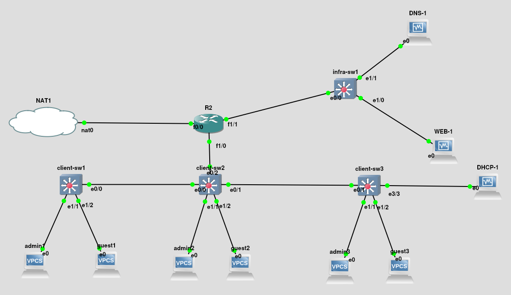
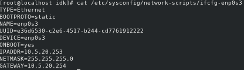
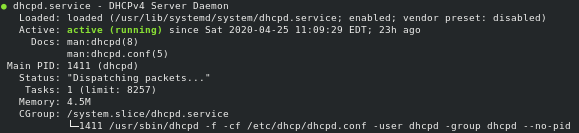
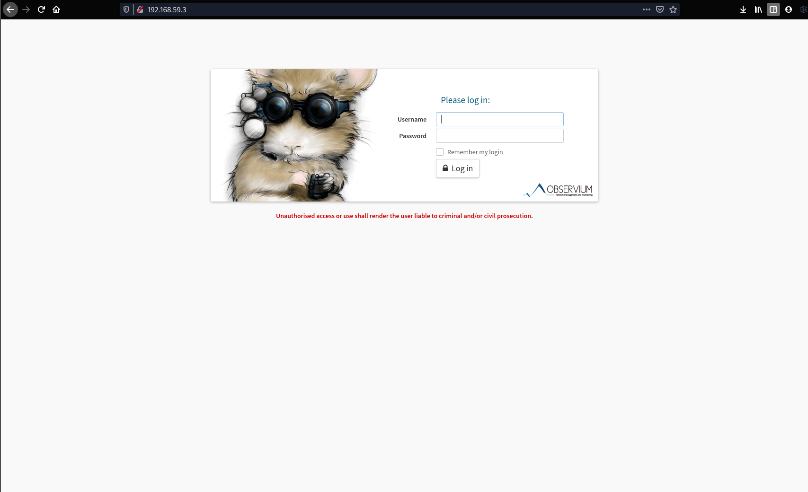
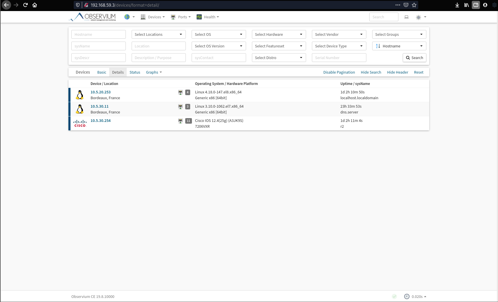

# TP4 : Buffet à volonté

## La topo

### Schéma GNS

<div align="center"></div>

### Tableau des réseaux

| Name     | Address        | VLAN |
|----------|----------------|------|
| `admins` | `10.5.10.0/24` | 10   |
| `guests` | `10.5.20.0/24` | 20   |
| `infra`  | `10.5.30.0/24` | 30   |

### Tableau d'adressage

| Machine  | `admins`      | `guests`      | `infra`       |
|----------|---------------|---------------|---------------|
| `r2`     | `10.5.10.254` | `10.5.20.254` | `10.5.30.254` |
| `admin1` | `10.5.10.11`  | x             | x             |
| `admin2` | `10.5.10.12`  | x             | x             |
| `admin3` | `10.5.10.13`  | x             | x             |
| `guest1` | x             | `10.5.20.102` | x             |
| `guest2` | x             | `10.5.20.103` | x             |
| `guest3` | x             | `10.5.20.101` | x             |
| `dhcp-1`   | x             | `10.5.20.253` | x             |
| `dns-1`    | x             | x             | `10.5.30.11`  |
| `web-1`    | x             | x             | `10.5.30.12`  |


## Mise en place Routeur / Client-sw[1:3] / Infra-sw1 / DHCP / DNS

### Routeur

Fichier de conf ici:
* [R2](./fichiers_tp4/r2.txt)

**show run:**

```
...
         
interface FastEthernet0/0
 ip address dhcp
 ip nat outside
 ip virtual-reassembly
 duplex half
!         
interface FastEthernet1/0
 no ip address
 duplex auto
 speed auto
!         
interface FastEthernet1/0.10
 encapsulation dot1Q 10
 ip address 10.5.10.254 255.255.255.0
 ip nat inside
 ip virtual-reassembly
!         
interface FastEthernet1/0.20
 encapsulation dot1Q 20
 ip address 10.5.20.254 255.255.255.0
 ip nat inside
 ip virtual-reassembly
!         
interface FastEthernet1/1
 no ip address
 duplex auto
 speed auto
!         
interface FastEthernet1/1.30
 encapsulation dot1Q 30
 ip address 10.5.30.254 255.255.255.0
 ip nat inside
 ip virtual-reassembly
!         
interface FastEthernet2/0
 no ip address
 shutdown 
 duplex auto
 speed auto
!         
interface FastEthernet2/1
 no ip address
 shutdown 
 duplex auto
 speed auto
!         
interface FastEthernet3/0
 no ip address
 shutdown 
 duplex auto
 speed auto
!         
interface FastEthernet3/1
 no ip address
 shutdown 
 duplex auto
 speed auto
!         
!         
ip forward-protocol nd
!         
no ip http server
no ip http secure-server
!         
ip nat inside source list 1 interface FastEthernet0/0 overload
!         
access-list 1 permit any
snmp-server community tp5b2 RO
no cdp log mismatch duplex
...
```

### Client-sw1

Fichier de conf ici:
* [Client-sw1](./fichiers_tp4/sw1.txt)

**show vlan:**
```
VLAN Name                             Status    Ports
---- -------------------------------- --------- -------------------------------
1    default                          active    Et0/1, Et0/2, Et0/3, Et1/0
                                                Et1/3, Et2/0, Et2/1, Et2/2
                                                Et2/3, Et3/0, Et3/1, Et3/2
                                                Et3/3
10   admins                           active    Et1/1
20   guests                           active    Et1/2
30   infra                            active    
1002 fddi-default                     act/unsup 
1003 token-ring-default               act/unsup 
1004 fddinet-default                  act/unsup 
1005 trnet-default                    act/unsup 

VLAN Type  SAID       MTU   Parent RingNo BridgeNo Stp  BrdgMode Trans1 Trans2
---- ----- ---------- ----- ------ ------ -------- ---- -------- ------ ------
1    enet  100001     1500  -      -      -        -    -        0      0   
10   enet  100010     1500  -      -      -        -    -        0      0   
20   enet  100020     1500  -      -      -        -    -        0      0   
30   enet  100030     1500  -      -      -        -    -        0      0   
1002 fddi  101002     1500  -      -      -        -    -        0      0   
1003 tr    101003     1500  -      -      -        -    -        0      0   
1004 fdnet 101004     1500  -      -      -        ieee -        0      0   
1005 trnet 101005     1500  -      -      -        ibm  -        0      0   
```

### Client-sw2

Fichier de conf ici:
* [Client-sw2](./fichiers_tp4/sw2.txt)

**show vlan:**
```
VLAN Name                             Status    Ports
---- -------------------------------- --------- -------------------------------
1    default                          active    Et0/3, Et1/0, Et1/3, Et2/0
                                                Et2/1, Et2/2, Et2/3, Et3/0
                                                Et3/1, Et3/2, Et3/3
10   admins                           active    Et1/1
20   guests                           active    Et1/2
30   infra                            active    
1002 fddi-default                     act/unsup 
1003 token-ring-default               act/unsup 
1004 fddinet-default                  act/unsup 
1005 trnet-default                    act/unsup 

VLAN Type  SAID       MTU   Parent RingNo BridgeNo Stp  BrdgMode Trans1 Trans2
---- ----- ---------- ----- ------ ------ -------- ---- -------- ------ ------
1    enet  100001     1500  -      -      -        -    -        0      0   
10   enet  100010     1500  -      -      -        -    -        0      0   
20   enet  100020     1500  -      -      -        -    -        0      0   
30   enet  100030     1500  -      -      -        -    -        0      0   
1002 fddi  101002     1500  -      -      -        -    -        0      0   
1003 tr    101003     1500  -      -      -        -    -        0      0   
1004 fdnet 101004     1500  -      -      -        ieee -        0      0   
1005 trnet 101005     1500  -      -      -        ibm  -        0      0   

Primary Secondary Type              Ports
------- --------- ----------------- ------------------------------------------
```

### Client-sw3

Fichier de conf ici:
* [Client-sw3](./fichiers_tp4/sw3.txt)

**show vlan:**
```
VLAN Name                             Status    Ports
---- -------------------------------- --------- -------------------------------
1    default                          active    Et0/0, Et0/2, Et0/3, Et1/0
                                                Et1/3, Et2/0, Et2/1, Et2/2
                                                Et2/3, Et3/0, Et3/1, Et3/2
10   admins                           active    Et1/1
20   guests                           active    Et1/2, Et3/3
30   infra                            active    
1002 fddi-default                     act/unsup 
1003 token-ring-default               act/unsup 
1004 fddinet-default                  act/unsup 
1005 trnet-default                    act/unsup 

VLAN Type  SAID       MTU   Parent RingNo BridgeNo Stp  BrdgMode Trans1 Trans2
---- ----- ---------- ----- ------ ------ -------- ---- -------- ------ ------
1    enet  100001     1500  -      -      -        -    -        0      0   
10   enet  100010     1500  -      -      -        -    -        0      0   
20   enet  100020     1500  -      -      -        -    -        0      0   
30   enet  100030     1500  -      -      -        -    -        0      0   
1002 fddi  101002     1500  -      -      -        -    -        0      0   
1003 tr    101003     1500  -      -      -        -    -        0      0   
1004 fdnet 101004     1500  -      -      -        ieee -        0      0   
1005 trnet 101005     1500  -      -      -        ibm  -        0      0   

Primary Secondary Type              Ports
------- --------- ----------------- ------------------------------------------
```
### Infra-sw1

Fichier de conf ici:
* [Infra-sw1](./fichiers_tp4/infrasw1.txt)
  
**show vlan:**
```
VLAN Name                             Status    Ports
---- -------------------------------- --------- -------------------------------
1    default                          active    Et0/1, Et0/2, Et0/3, Et1/2
                                                Et1/3, Et2/0, Et2/1, Et2/2
                                                Et2/3, Et3/0, Et3/1, Et3/2
                                                Et3/3
10   admins                           active    
20   guests                           active    
30   infra                            active    Et1/0, Et1/1
1002 fddi-default                     act/unsup 
1003 token-ring-default               act/unsup 
1004 fddinet-default                  act/unsup 
1005 trnet-default                    act/unsup 

VLAN Type  SAID       MTU   Parent RingNo BridgeNo Stp  BrdgMode Trans1 Trans2
---- ----- ---------- ----- ------ ------ -------- ---- -------- ------ ------
1    enet  100001     1500  -      -      -        -    -        0      0   
10   enet  100010     1500  -      -      -        -    -        0      0   
20   enet  100020     1500  -      -      -        -    -        0      0   
30   enet  100030     1500  -      -      -        -    -        0      0   
1002 fddi  101002     1500  -      -      -        -    -        0      0   
1003 tr    101003     1500  -      -      -        -    -        0      0   
1004 fdnet 101004     1500  -      -      -        ieee -        0      0   
1005 trnet 101005     1500  -      -      -        ibm  -        0      0   

Primary Secondary Type              Ports
------- --------- ----------------- ------------------------------------------
```
### DHCP-1 (Sur centos 8)

***
Conf de la carte réseau:
<div align="center"></div>

***

Mettre centos à jour:
```
yum update
```

Télécharger le paquet DHCP:
```
yum install dhcp
```
***
Fichier de conf(à mettre dans /etc/dhcp/dhcpd.conf) [DHCP-1](./fichiers_tp4/dhcp1.txt).

Pour démarer le service dhcp:
  
```
systemctl start dhcpd.service
```
Pour l'activer à chaque démarage:
```
systemctl enable dhcpd.service
```

<div align="center"></div>

Le DHCP servira à attribuer des adresses IP aux Guests. (Pas aux Admins)


### DNS-1 (Sur centos 7)
Conf de la carte réseau:

```
[root@dns named]# cat /etc/sysconfig/network-scripts/ifcfg-enp0s3
TYPE="Ethernet"
BOOTPROTO="static"
NAME="enp0s3"
UUID="ae926624-baec-4ec1-8de6-ac7b6e379c0c"
DEVICE="enp0s3"
ONBOOT="yes"
IPADDR=10.5.30.11
NETMASK=255.255.255.0
GATEWAY=10.5.30.254
```

Mettre centos à jour:
```
yum update
```

Télécharger Bind et Bind-utils:

```
yum install bind bind-utils
```

Fichier de conf /etc/named.conf
```
ptions {
	listen-on port 53 { 127.0.0.1; 10.5.30.11; };
	listen-on-v6 port 53 { ::1; };
	directory 	"/var/named";
	dump-file 	"/var/named/data/cache_dump.db";
	statistics-file "/var/named/data/named_stats.txt";
	memstatistics-file "/var/named/data/named_mem_stats.txt";
	recursing-file  "/var/named/data/named.recursing";
	secroots-file   "/var/named/data/named.secroots";
	allow-query     { localhost; 10.5.10.0/24; 10.5.20.0/24;};

	/* 
	 - If you are building an AUTHORITATIVE DNS server, do NOT enable recursion.
	 - If you are building a RECURSIVE (caching) DNS server, you need to enable 
	   recursion. 
	 - If your recursive DNS server has a public IP address, you MUST enable access 
	   control to limit queries to your legitimate users. Failing to do so will
	   cause your server to become part of large scale DNS amplification 
	   attacks. Implementing BCP38 within your network would greatly
	   reduce such attack surface 
	*/
	recursion yes;

	dnssec-enable yes;
	dnssec-validation yes;

	/* Path to ISC DLV key */
	bindkeys-file "/etc/named.root.key";

	managed-keys-directory "/var/named/dynamic";

	pid-file "/run/named/named.pid";
	session-keyfile "/run/named/session.key";
};

logging {
        channel default_debug {
                file "data/named.run";
                severity dynamic;
        };
};

zone "." IN {
	type hint;
	file "named.ca";
};

zone "tp5.b2" IN {
         
         type master;
        
         file "/var/named/tp5.b2.db";

         allow-update { none; };
};

zone "20.5.10.in-addr.arpa" IN {
          
          type master;
          
          file "/var/named/20.5.10.db";
         
          allow-update { none; };
};


include "/etc/named.rfc1912.zones";
include "/etc/named.root.key";
```
***
* Fichier de conf dans /var/named/tp5.b2.db:

```
[root@dns named]# cat /var/named/tp5.b2.db 
$TTL    604800
@   IN  SOA     ns1.tp5.b2. root.tp5.b2. (
                                                1001    ;Serial
                                                3H      ;Refresh
                                                15M     ;Retry
                                                1W      ;Expire
                                                1D      ;Minimum TTL
                                                )

;Name Server Information
@      IN  NS      ns1.tp5.b2.

ns1 IN  A       10.5.30.11
guest1     IN  A       10.5.20.102
guest2     IN  A       10.5.20.103
guest3     IN  A       10.5.20.101
dhcp       IN  A       10.5.20.253

```
***

* Fichier de conf dans /var/named/20.5.10

```
[root@dns named]# cat /var/named/20.5.10.db 
$TTL    604800
@   IN  SOA     ns1.tp5.b2. root.tp5.b2. (
                                                1001    ;Serial
                                                3H      ;Refresh
                                                15M     ;Retry
                                                1W      ;Expire
                                                1D      ;Minimum TTL
                                                )

;Name Server Information
@ IN  NS      ns1.tp5.b2.


11.30.5.10 IN PTR ns1.tp5.b2.

;PTR Record IP address to HostName
102      IN  PTR     guest1.tp5.b2.
103      IN  PTR     guest2.tp5.b2.
101      IN  PTR     guest3.tp5.b2.
253      IN  PTR     dhcp.tp5.b2.
```
***

**Maintenant le firewall !**

Il faut ouvrir le port 53 en udp.

```
firewall-cmd --permanent --add-port=53/udp
firewall-cmd --reload
```

Résultat:
```
[root@dns named]# firewall-cmd --list-all
public (active)
  target: default
  icmp-block-inversion: no
  interfaces: enp0s3 enp0s8
  sources: 
  services: dhcpv6-client snmp ssh
  ports: 53/udp 161/udp
  protocols: 
  masquerade: no
  forward-ports: 
  source-ports: 
  icmp-blocks: 
  rich rules: 
```
*Bon moi il y a aussi le port 161 mais c'est pour plus tard ça*

Démarons notre DNS !!

```
systemctl enable named.service
systemctl start named.service
```
Voyons si il marche:

```
root@dns named]# systemctl status named
● named.service - Berkeley Internet Name Domain (DNS)
   Loaded: loaded (/usr/lib/systemd/system/named.service; enabled; vendor preset: disabled)
   Active: active (running) since Sat 2020-04-25 23:24:37 CEST; 18h ago
  Process: 9448 ExecReload=/bin/sh -c /usr/sbin/rndc reload > /dev/null 2>&1 || /bin/kill -HUP $MAINPID (code=exited, status=0/SUCCESS)
 Main PID: 8078 (named)
   CGroup: /system.slice/named.service
           └─8078 /usr/sbin/named -u named -c /etc/named.conf
```
*La lumière est verte !*


Regardons avec la commande SS:
```
[root@dns named]# ss -lupn
State      Recv-Q Send-Q Local Address:Port               Peer Address:Port              
UNCONN     0      0      10.5.30.11:53                         *:*                   users:(("named",pid=8078,fd=513))
UNCONN     0      0      127.0.0.1:53                         *:*                   users:(("named",pid=8078,fd=512))
UNCONN     0      0              *:68                         *:*                   users:(("dhclient",pid=887,fd=6))
UNCONN     0      0              *:161                        *:*                   users:(("snmpd",pid=8526,fd=6))
UNCONN     0      0          [::1]:53                      [::]:*                   users:(("named",pid=8078,fd=514))
```
*Tout est good ! :)*

## Mise en place Guest[1:3] / Admin[1:3]

### Commandes pour Guest1 / Guest2 / Guest3:
***
Première commande:
```
ip dhcp
```
Résultat:
```
DDORA IP 10.5.20.103/24 GW 10.5.20.254
```
***

Deuxième commande:
```
save
```
résultat:
```
Bah ça save
```

... FINI !

### Show ip pour Guest1 / Guest2 / Guest3:

On pourra alors voir notre magnifique DHCP / DNS / DOMAIN NAME / IP et plein de belles choses encore !

* Guest1:

```
guest1> show ip

NAME        : guest1[1]
IP/MASK     : 10.5.20.102/24
GATEWAY     : 10.5.20.254
DNS         : 10.5.30.11  
DHCP SERVER : 10.5.20.253
DHCP LEASE  : 519, 600/300/525
DOMAIN NAME : tp5.b2
MAC         : 00:50:79:66:68:01
LPORT       : 20030
RHOST:PORT  : 127.0.0.1:20031
MTU:        : 1500
```

* Guest2:

```
NAME        : guest2[1]
IP/MASK     : 10.5.20.103/24
GATEWAY     : 10.5.20.254
DNS         : 10.5.30.11  
DHCP SERVER : 10.5.20.253
DHCP LEASE  : 387, 600/300/525
DOMAIN NAME : tp5.b2
MAC         : 00:50:79:66:68:03
LPORT       : 20036
RHOST:PORT  : 127.0.0.1:20037
MTU:        : 1500
```

* Guest3:

```
NAME        : guest3[1]
IP/MASK     : 10.5.20.101/24
GATEWAY     : 10.5.20.254
DNS         : 10.5.30.11  
DHCP SERVER : 10.5.20.253
DHCP LEASE  : 315, 600/300/525
DOMAIN NAME : tp5.b2
MAC         : 00:50:79:66:68:05
LPORT       : 20040
RHOST:PORT  : 127.0.0.1:20041
MTU:        : 1500
```
### Commandes pour Admin1 / Admin2 / Admin3:

***
Première commande:

```
ip <address> <mask> <gateway>
ip 10.5.10.12 255.255.255.0 10.5.10.254
```
(Changer l'ip pour chaque machine)

Résultat:

```
Checking for duplicate address...
PC1 : 10.5.10.12 255.255.255.0 gateway 10.5.10.254
```
***
Deuxième commande:

```
ip dns 10.5.30.11
```

Résultat:

```
NONE
```

***
Troisième commande:

```
save
```
résultat:
```
Bah ça save
```

### Show ip pour Admin1/ Admin2 / Admin3:

* Admin1:

```
NAME        : admin1[1]
IP/MASK     : 10.5.10.11/24
GATEWAY     : 10.5.10.254
DNS         : 10.5.30.11  
MAC         : 00:50:79:66:68:00
LPORT       : 20032
RHOST:PORT  : 127.0.0.1:20033
MTU:        : 1500
```

* Admin2:

```
NAME        : admin2[1]
IP/MASK     : 10.5.10.12/24
GATEWAY     : 10.5.10.254
DNS         : 10.5.30.11  
MAC         : 00:50:79:66:68:02
LPORT       : 20034
RHOST:PORT  : 127.0.0.1:20035
MTU:        : 1500
```

* Admin3:

```
NAME        : admin3[1]
IP/MASK     : 10.5.10.13/24
GATEWAY     : 10.5.10.254
DNS         : 10.5.30.11  
MAC         : 00:50:79:66:68:04
LPORT       : 20038
RHOST:PORT  : 127.0.0.1:20039
MTU:        : 1500
```
### PING (On va pas tout faire)

(Je ne peux pas PING mes Admins via le hostname car je ne l'ai pas mis dans la conf de mon DNS)

* Guest1 -> Guest2:

```
guest1> ping guest2.tp5.b2
guest2.tp5.b2 resolved to 10.5.20.103
84 bytes from 10.5.20.103 icmp_seq=1 ttl=64 time=0.350 ms
```

* Guest1 -> Guest3:

```
guest1> ping guest3.tp5.b2
guest3.tp5.b2 resolved to 10.5.20.101
84 bytes from 10.5.20.101 icmp_seq=1 ttl=64 time=0.523 ms
```

* Guest1 -> Admin1:

```
guest1> ping 10.5.10.11
10.5.10.11 icmp_seq=1 timeout
84 bytes from 10.5.10.11 icmp_seq=2 ttl=63 time=34.565 ms
```

* Guest1 -> Admin2:

```
guest1> ping 10.5.10.12
10.5.10.12 icmp_seq=1 timeout
10.5.10.12 icmp_seq=2 timeout
84 bytes from 10.5.10.12 icmp_seq=3 ttl=63 time=34.285 ms
```

* Guest1 -> Admin3:

```
guest1> ping 10.5.10.13
10.5.10.13 icmp_seq=1 timeout
10.5.10.13 icmp_seq=2 timeout
84 bytes from 10.5.10.13 icmp_seq=3 ttl=63 time=33.638 ms
```

* Guest1 -> DNS-1:

```
guest1> ping ns1.tp5.b2
ns1.tp5.b2 resolved to 10.5.30.11
84 bytes from 10.5.30.11 icmp_seq=1 ttl=63 time=23.612 ms
```

* Guest1 -> DHCP-1:

```
guest1> ping dhcp.tp5.b2
dhcp.tp5.b2 resolved to 10.5.20.253
84 bytes from 10.5.20.253 icmp_seq=1 ttl=64 time=1.135 ms
```

* Guest1 -> 1.1.1.1:

```
guest1> ping 1.1.1.1    
84 bytes from 1.1.1.1 icmp_seq=1 ttl=59 time=61.435 ms
```
***

* Admin1 -> Guest1:

```
admin1> ping guest1.tp5.b2
guest1.tp5.b2 resolved to 10.5.20.102
84 bytes from 10.5.20.102 icmp_seq=1 ttl=63 time=36.389 ms
```

* Admin1 -> Guest2:

```
admin1> ping guest2.tp5.b2
guest2.tp5.b2 resolved to 10.5.20.103
guest2.tp5.b2 icmp_seq=1 timeout
guest2.tp5.b2 icmp_seq=2 timeout
84 bytes from 10.5.20.103 icmp_seq=3 ttl=63 time=36.215 ms
```

* Admin1 -> Guest3:

```
admin1> ping guest3.tp5.b2
guest3.tp5.b2 resolved to 10.5.20.101
guest3.tp5.b2 icmp_seq=1 timeout
guest3.tp5.b2 icmp_seq=2 timeout
84 bytes from 10.5.20.101 icmp_seq=3 ttl=63 time=34.600 ms
```

* Admin1 -> Admin2:

```
admin1> ping 10.5.10.12   
84 bytes from 10.5.10.12 icmp_seq=1 ttl=64 time=0.298 ms
```

* Admin1 -> Admin3:

```
admin1> ping 10.5.10.13
84 bytes from 10.5.10.13 icmp_seq=1 ttl=64 time=0.894 ms
```

* Admin1 -> DNS-1:

```
admin1> ping ns1.tp5.b2
ns1.tp5.b2 resolved to 10.5.30.11
84 bytes from 10.5.30.11 icmp_seq=1 ttl=63 time=29.066 ms
```

* Admin1 -> DHCP-1:

```
admin1> ping dhcp.tp5.b2
dhcp.tp5.b2 resolved to 10.5.20.253
84 bytes from 10.5.20.253 icmp_seq=1 ttl=63 time=44.255 ms
```

* Admin1 -> 1.1.1.1:

```
admin1> ping 1.1.1.1
84 bytes from 1.1.1.1 icmp_seq=1 ttl=59 time=75.150 ms
```

## Sujet: Métrologie Réseau (SNMP, monitoring, gestion de logs)

### Mise en place de notre serveur WEB pour accueillir Obervium (centos 7)

* Conf de la carte réseau:
```
[root@web observium]# cat /etc/sysconfig/network-scripts/ifcfg-enp0s3
TYPE="Ethernet"
BOOTPROTO="static"
NAME="enp0s3"
UUID="ae926624-baec-4ec1-8de6-ac7b6e379c0c"
DEVICE="enp0s3"
ONBOOT="yes"
IPADDR=10.5.30.12
NETMASK=255.255.255.0
GATEWAY=10.5.30.254
```
1. On va installer plus de repo:

```
yum install https://dl.fedoraproject.org/pub/epel/epel-release-latest-7.noarch.rpm
yum install http://yum.opennms.org/repofiles/opennms-repo-stable-rhel7.noarch.rpm
yum install http://rpms.remirepo.net/enterprise/remi-release-7.rpm
```

2. Télécharger et Installer yum-utils:

```
yum install yum-utils
```

3. Enable le repo remi-php72:
   

```
yum-config-manager --enable remi-php72
```

4. On update:

```
yum update
```

5. On télécharge les paquets utiles à Obersium:

```
yum install wget.x86_64 httpd.x86_64 php.x86_64 php-opcache.x86_64 php-mysql.x86_64 php-gd.x86_64 \
            php-posix php-pear.noarch cronie.x86_64 net-snmp.x86_64 net-snmp-utils.x86_64 \
            fping.x86_64 mariadb-server.x86_64 mariadb.x86_64 MySQL-python.x86_64 rrdtool.x86_64 \
            subversion.x86_64  jwhois.x86_64 ipmitool.x86_64 graphviz.x86_64 ImageMagick.x86_64 \
            php-sodium.x86_64
```

6. Si on utilise des machines virtuelles nous avons besoin de ceci:

```
yum install libvirt.x86_64
```

7. On crée un dossier Observium dans /opt:

```
mkdir -p /opt/observium && cd /opt
```

8. On télécharge Observium et on le décompresse:

```
wget http://www.observium.org/observium-community-latest.tar.gz
tar zxvf observium-community-latest.tar.gz
```

9. Pour activer les mises à jours automatiquement:

```
svn co http://svn.observium.org/svn/observium/branches/stable observium
```

10. Démarrer mariadb:

```
systemctl enable mariadb
systemctl start mariadb
```
11. "Set" le mot de passe de root:

```
/usr/bin/mysqladmin -u root password '<mysql root password>'
```

12. Créer la base de données:

```
mysql -u root -p
<mysql root password>
mysql> CREATE DATABASE observium DEFAULT CHARACTER SET utf8 COLLATE utf8_general_ci;
mysql> GRANT ALL PRIVILEGES ON observium.* TO 'observium'@'localhost' IDENTIFIED BY '<observium db password>';
mysql> exit;
```
13. Aller dans le dossier d'Obersium et copier le fichier de conf:
    
```
cd /opt/observium/
cp config.php.default config.php
```

14. Initialisation du schéma de la base de données:

```
./discovery.php -u
```

15. Trouver le path de fping:

```
which fping
```

16. Editer le fichier ./config.php
  * Changer le Db name et DB password
  * Ajouter cette ligne pour fping `$config['fping'] = "<votre path fping>";`
  * Remplacer public dans la ligne `$config['snmp']['community'] = array("public")`, par le nom de votre choix.

le fichier de conf donne ça:

```
[root@web observium]# cat /opt/observium/config.php
<?php

## Check http://www.observium.org/docs/config_options/ for documentation of possible settings

## It's recommended that settings are edited in the web interface at /settings/ on your observium installation.
## Authentication and Database settings must be hardcoded here because they need to work before you can reach the web-based configuration interface

// Database config ---  This MUST be configured
$config['db_extension'] = 'mysqli';
$config['db_host']      = 'localhost';
$config['db_user']      = 'observium';
$config['db_pass']      = 'MON_MDP';
$config['db_name']      = 'observium';

// Base directory
#$config['install_dir'] = "/opt/observium";
$config['fping'] = "/usr/sbin/fping";
// Default community list to use when adding/discovering
$config['snmp']['community'] = array("tp5b2");

// Authentication Model
$config['auth_mechanism'] = "mysql";    // default, other options: ldap, http-auth, please see documentation for config help

// Enable alerter
// $config['poller-wrapper']['alerter'] = TRUE;

//$config['web_show_disabled'] = FALSE;    // Show or not disabled devices on major pages.

// Set up a default alerter (email to a single address)
//$config['email']['default']        = "user@your-domain";
//$config['email']['from']           = "Observium <observium@your-domain>";
//$config['email']['default_only']   = TRUE;

// End config.php
```
17. Faire un setenforce 0 puis modifier le fichier /etc/selinux/config pour éviter de faire un setenfoce 0 à chaque redémarrage:

```
senteforce 0
vi /etc/selinux/config
```
* Trouver la ligne avec `SELINUX=XXXXX` et remplacer la par `SELINUX=permissive`

18. Créer un dossier rdd dans /opt/observium et faire un chown dessus pour apache:
    
```
mkdir /opt/observium/rrd
chown apache:apache rrd
```

19.  Créer le fichier `/etc/httpd/conf.d/observium.conf` copier ceci dedans:

```
<VirtualHost *>
   DocumentRoot /opt/observium/html/
   ServerName  observium.tp5.b2.com
   CustomLog /opt/observium/logs/access_log combined
   ErrorLog /opt/observium/logs/error_log
   <Directory "/opt/observium/html/">
     AllowOverride All
     Options FollowSymLinks MultiViews
     Require all granted
   </Directory>
</VirtualHost>
```

20. Créer un dossier pour les logs apache:

```
mkdir /opt/observium/logs
chown apache:apache /opt/observium/logs
```

21. Créer un user Observium (level 10 pour un Admin):

```
cd /opt/observium
./adduser.php <username> <password> <level>
```

22. Créer un nouveau fichier dans `/etc/cron.d/observium` et copier ceci dedans:

```
# Run a complete discovery of all devices once every 6 hours
33  */6   * * *   root    /opt/observium/discovery.php -h all >> /dev/null 2>&1

# Run automated discovery of newly added devices every 5 minutes
*/5 *     * * *   root    /opt/observium/discovery.php -h new >> /dev/null 2>&1

# Run multithreaded poller wrapper every 5 minutes
*/5 *     * * *   root    /opt/observium/poller-wrapper.py >> /dev/null 2>&1

# Run housekeeping script daily for syslog, eventlog and alert log
13 5 * * * root /opt/observium/housekeeping.php -ysel

# Run housekeeping script daily for rrds, ports, orphaned entries in the database and performance data
47 4 * * * root /opt/observium/housekeeping.php -yrptb
```

et on reload:

```
systemctl reload crond
```

23. Ajouter le service http au firewall:

```
firewall-cmd --permanent --zone=public --add-service=http
firewall-cmd --reload
```

24. Démarrer Apache:

```
systemctl enable httpd
systemctl start httpd
```

25. **BOOOOOOOOOM !**

<div align="center"></div>

Connectez vous avec votre utilisateur Observium créé au préalable !

*Mais ou sont mes devices il n'y à rien ? :'( - PATIENCE*

Bon c'est bien beau tout ça mais on n'a pas un device !

***

### Ajouter les devices sur notre serveur Observium: R2, DHCP-1 et DNS-1:

* R2:

```
conf t
snmp-server community tp5b2 RO
exit
wr
```
*Oui c'est tout*
***

* DHCP-1 et DNS-1:

Il faut installer `net-snmp` et `snmp-utils`

```
yum install net-snmp net-snmp-utils
```

On copie le conf original:

```
mv /etc/snmp/snmpd.conf /etc/snmp/snmpd.conf.orig
```

On ajoute le service snmp au firewall:

```
firewall-cmd --permanent --zone=public --add-service=snmp
firewall-cmd --add-port=161/udp --permanent
firewall-cmd --reload
```

On démarre le service snmp:

```
systemctl enable snmpd.service
systemctl start snmpd.service
```
***

Maitenant pour mettre notre serveur à jour deux solutions !
1. On attend 5 minutes. (Et oui grâce à notre fichier cron il se met à jour toutes les 5 minutes)
2. Ou alors nous avons un petit script sur notre serveur qui nous permet de faire ça !

### Mettre à jour notre serveur.

Première chose à faire, ajouter tout les devices avec cette commande:

```
/opt/observium/add_device.php <hostname> <community> v2c
/opt/observium/add_device.php 10.5.30.11 tp5b2 v2c
```
*(Commande à faire pour chaque device bien sur)*

Deuxième chose à faire, lancer les deux scripts suivants (de se que j'ai compris il ajoute les devices dans la base de données): 

```
/opt/observium/discovery.php -h all
/opt/observium/poller.php -h all
```
Troisème et dernière chose à faire:

ENJOOOOOOOOY !

<div align="center"></div>

